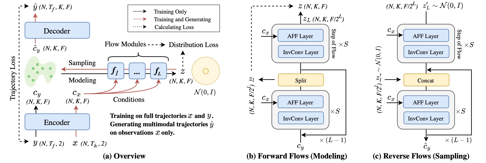
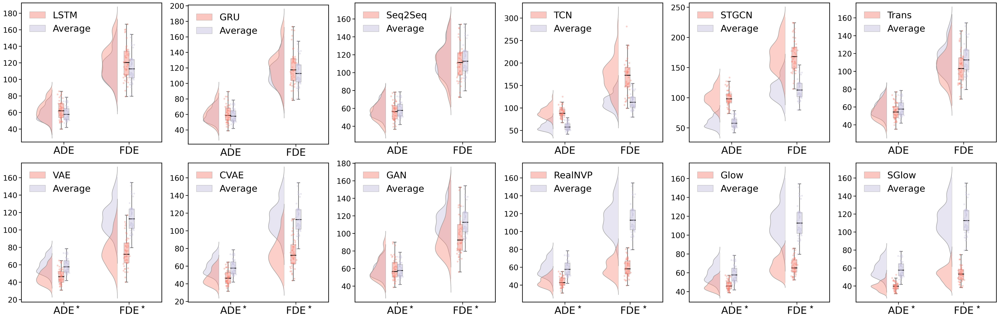
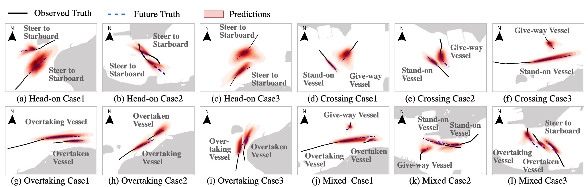
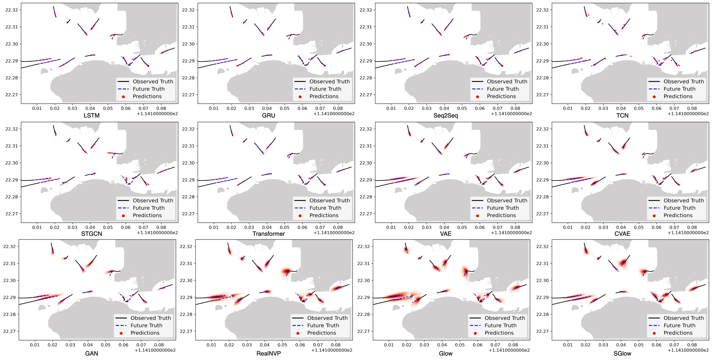
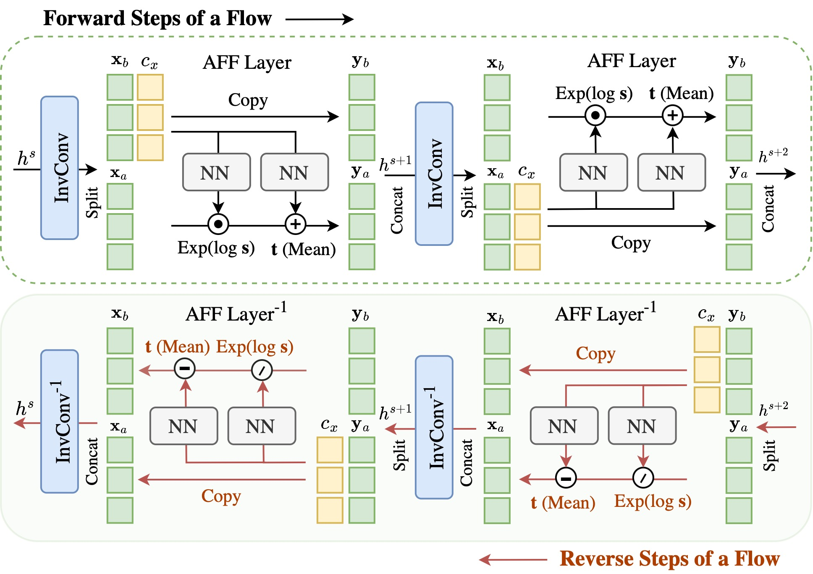

<div align="center">

# SGlow

### Probabilistic Vessel Trajectory Prediction with Sequential Generative Flows

Official PyTorch implementation of **"Seeking Safety From Uncertainty: Probabilistic Vessel Trajectory Prediction With a Flow-Based Generative Model"**, published in *IEEE Transactions on Industrial Informatics* (2026).

[](https://doi.org/10.1109/TII.2026.3688228)
[](https://doi.org/10.1109/TII.2026.3688228)
[](https://www.python.org/)
[](https://pytorch.org/)

**Kaisen Yang, Yuxu Lu, and Dong Yang**

</div>

SGlow is a conditional normalizing-flow model for **multimodal vessel trajectory prediction from AIS data**. Given one observed trajectory, it learns a distribution over future vessel motion and generates multiple plausible futures for maritime safety, intelligent transportation, and autonomous surface-vessel navigation.

<p align="center">
  
</p>

## Highlights

- **Uncertainty-aware prediction:** generates `K = 20` plausible future trajectories from a single observation instead of committing to one deterministic path.
- **Exact distribution learning:** uses invertible normalizing flows with affine coupling (AFF) and invertible `1 x 1` convolution (InvConv) layers, enabling exact log-likelihood optimization.
- **Sequential context modeling:** combines GRU encoders, conditional flow modules, and a recurrent decoder to connect trajectory evolution with latent distribution learning.
- **Long-horizon evaluation:** evaluates prediction horizons from **160 to 640 seconds** on congested Hong Kong waters.
- **Comprehensive benchmark:** includes implementations of SGlow, 11 deterministic and generative baselines, and the ablation variants reported in the paper.

## Results

SGlow reports the lowest mean ADE and FDE at every evaluated horizon among the 12 models in the paper. The original paper figure below shows the prediction-error distributions of all models for the 160-second task.

<p align="center">
  
</p>

| Prediction horizon | SGlow ADE* (m) | Best baseline ADE* (m) | SGlow FDE* (m) | Best baseline FDE* (m) |
|:--:|--:|--:|--:|--:|
| 160 s | **40.7 &plusmn; 3.8** | 44.5 &plusmn; 4.5 (RealNVP) | **60.8 &plusmn; 7.4** | 62.9 &plusmn; 9.0 (RealNVP) |
| 320 s | **64.7 &plusmn; 6.9** | 67.6 &plusmn; 8.3 (Glow) | **103.7 &plusmn; 12.3** | 106.5 &plusmn; 14.1 (Glow) |
| 480 s | **93.7 &plusmn; 12.0** | 97.5 &plusmn; 12.6 (Glow) | **143.4 &plusmn; 22.2** | 145.2 &plusmn; 21.3 (Glow) |
| 640 s | **121.6 &plusmn; 18.1** | 122.9 &plusmn; 17.7 (Glow) | **172.9 &plusmn; 34.9** | 177.9 &plusmn; 33.0 (Glow) |

`ADE*` and `FDE*` are best-of-20 metrics for multimodal models. To assess the full predictive distribution rather than only its closest sample, the paper also reports sample-based KDE-NLL with a 50 m bandwidth. SGlow obtains the best KDE-NLL from 320 to 640 seconds: **12.56**, **13.74**, and **15.76**, respectively.

### Efficiency

| Model | Parameters | Inference time | GFLOPs | Training time |
|:--|--:|--:|--:|--:|
| SGlow, 160 s horizon | 0.56 M | 0.65 s | 5.11 | 20.85 min |
| SGlow, 640 s horizon | 0.56 M | 1.10 s | 18.37 | 35.01 min |

Times were measured in the paper using Python 3.9 and PyTorch on an NVIDIA GeForce RTX 4090 with an Intel Xeon Gold 6426Y CPU.

## Qualitative Predictions

SGlow captures uncertainty in head-on, crossing, overtaking, and mixed multi-vessel encounters. Black lines show observed motion, blue dashed lines show future ground truth, and red density regions summarize generated trajectories.

<p align="center">
  
</p>

<details>
<summary><b>View the qualitative comparison of all 12 models</b></summary>
<br>
<p align="center">
  
</p>
</details>

## Method

During training, SGlow encodes observed and future trajectories into context vectors. Conditional forward flows map the future context to a tractable Gaussian latent distribution and provide an exact distribution loss. During inference, latent samples are passed through the reverse flows and decoded into diverse future trajectories using only the observed context.

Each flow step combines:

1. an invertible `1 x 1` convolution to mix latent features; and
2. a history-conditioned affine coupling layer to transform the predictive distribution.

<details>
<summary><b>View the internal flow structure</b></summary>
<br>
<p align="center">
  
</p>
</details>

## Dataset and Protocol

The experiments use AIS trajectories collected from the Central Waterway of Victoria Harbour, Hong Kong, from **11 September to 10 November 2022**.

| Setting | Value |
|:--|:--|
| Geographic area | 114.101 to 114.190 E, 22.265 to 22.324 N |
| Trajectory segments | 50,174 |
| Sampling interval | 10 s after interpolation |
| Full segment length | 128 time steps |
| Train/test split | 8:2 |
| Observation/prediction ratio | 1:1 |
| Prediction horizons | 160, 320, 480, and 640 s |
| Generated modalities | 20 trajectories per observation |

The AIS data and pretrained checkpoints are **not included** in this repository. Researchers should obtain AIS data through an authorized provider and comply with its license and privacy requirements. The preprocessing script expects, at minimum, the columns `UpdateTime (UTC)`, `MMSI`, `Longitude (deg)`, `Latitude (deg)`, `Speed (kn)`, `Heading (deg)`, and `Length (m)`.

## Repository Structure

```text
TII_SGlow/
|-- main_run.py              # Experiment configuration and entry point
|-- processor.py             # Training, evaluation, checkpointing, prediction
|-- dataloader.py            # Dataset split, normalization, batch preparation
|-- visualization.py         # Trajectory visualization
|-- utils.py                 # ADE, FDE, and auxiliary metrics
|-- AIS_process/
|   |-- AIS_process.py       # Raw AIS preprocessing and interpolation
|   `-- Functions.py         # Preprocessing utilities
`-- Models/
    |-- SGlow.py             # Proposed SGlow model
    |-- Flows.py             # AFF, InvConv, decoder, and flow losses
    |-- Ablas.py             # Ablation variants
    |-- Compared_models.py   # LSTM, GRU, Seq2Seq, TCN, Transformer
    |-- STGCN.py
    |-- VAE.py
    |-- CVAE.py
    |-- GAN.py
    |-- RealNVP.py
    `-- Glow.py
```

## Getting Started

### 1. Clone and install

```bash
git clone https://github.com/KaysenWB/TII_SGlow.git
cd TII_SGlow/TII_SGlow

python3 -m venv .venv
source .venv/bin/activate
pip install torch numpy pandas scipy geopy matplotlib pytorch-tcn nflows torchprofile thop
```

The paper experiments used Python 3.9. Select a PyTorch build compatible with your CUDA installation when GPU acceleration is required.

### 2. Prepare AIS data

1. Set the input file, output file, time range, and geographic bounds near the top of `AIS_process/AIS_process.py`. For the paper protocol, use 128 report points and set `MGSC = False` to produce the `(trajectory, adjacency)` format consumed by the current dataloader.
2. Run the preprocessing script:

```bash
python AIS_process/AIS_process.py
```

3. Point `--data_root` to the resulting `.cpkl` file. The default expected path is `./Data/AIS_processed_com.cpkl`.

### 3. Train or evaluate

`main_run.py` is currently configured to evaluate SGlow over 16, 32, 48, and 64 prediction steps and expects checkpoints named `SGlow_best.tar` under the corresponding output directories.

To train models, enable `trainer.train()` in `main_run.py`, select the desired horizons and model names in the experiment lists, and run:

```bash
python main_run.py \
  --data_root ./Data/AIS_processed_com.cpkl \
  --device cuda:0 \
  --num_epochs 150
```

Predictions are saved as `Preds.npy`, ground truth trajectories as `Reals.npy`, and per-sample errors as `Error.npy` in each experiment directory.

## Citation

If this work is useful in your research, please consider starring the repository and citing the paper:

```bibtex
@article{yang2026seeking,
  author={Yang, Kaisen and Lu, Yuxu and Yang, Dong},
  journal={IEEE Transactions on Industrial Informatics},
  title={Seeking Safety From Uncertainty: Probabilistic Vessel Trajectory Prediction With a Flow-Based Generative Model},
  year={2026},
  pages={1--11},
  doi={10.1109/TII.2026.3688228}
}
```

## Contact

For questions and research collaboration, contact [Kaisen Yang](mailto:kaisen.yang@connect.polyu.hk).
